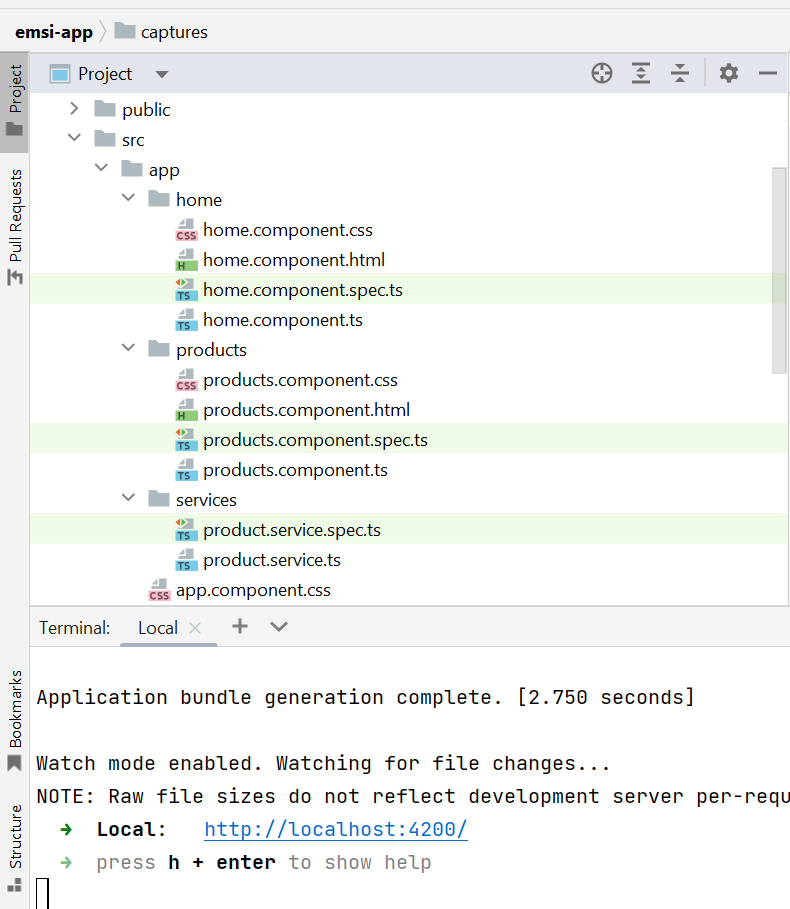
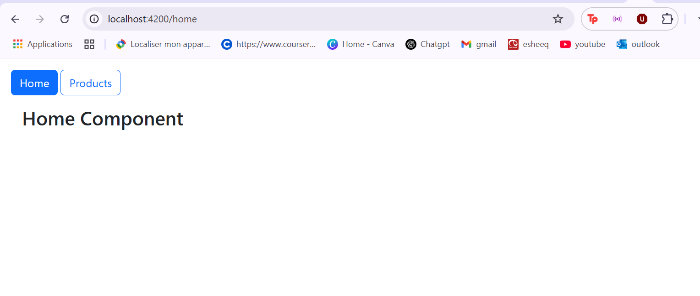
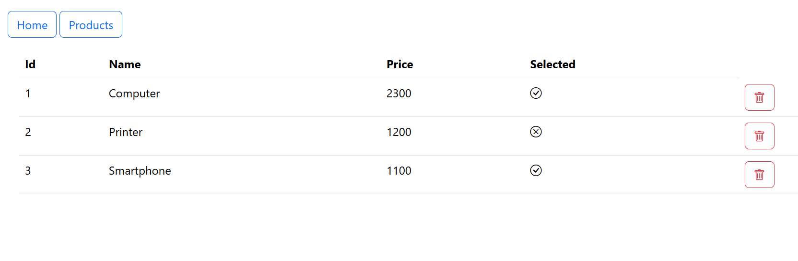
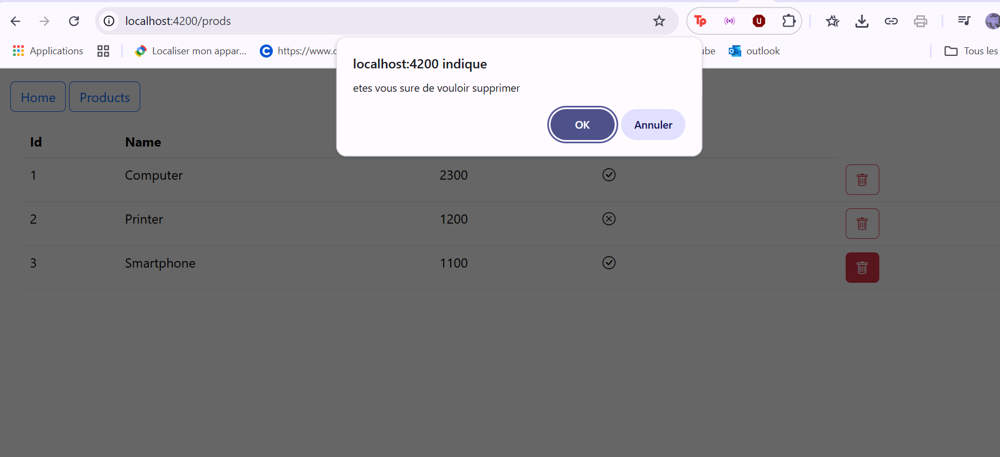
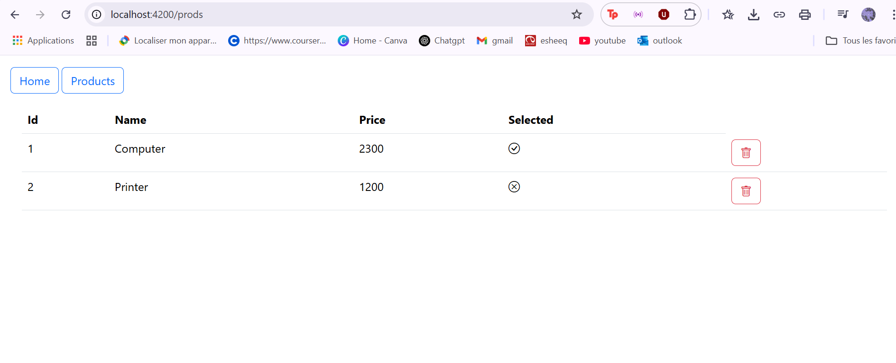

<h2>Activité Pratique N°5 - Angular Framework </h2>
<h3>Architecture du projet</h3>

<h3>affichage de Home</h3>

<h3>affichage de la liste des produits</h3>

<h3>affichage du message de confirmation de suppression</h3>

<h3>affichage de la liste des produits apres  suppression</h3>

